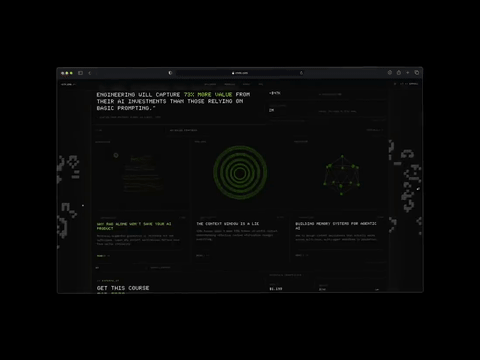
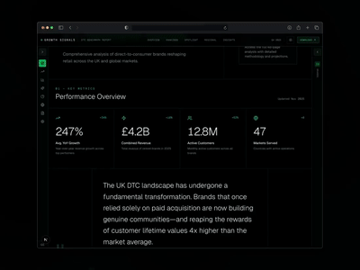

### WithSeismic

   

Full-stack engineer with 10 years building and shipping production products. Most of my hands-on work is TypeScript and React, with more recent work in Python, C++, and LLM tooling. I've founded and sold three products and spent the last decade running WithSeismic, delivering product and engineering work for companies including Contra, Framer, The Motley Fool, and MIT.

Lately a lot of agentic workflows, ~~MCP servers~~ CLI tools, and game internals.

London, UK / Prague, CZ.

 ![EU](https://img.shields.io/badge/EU-003399?style=flat-square&logo=data:image/svg%2bxml;base64,PHN2ZyB4bWxucz0iaHR0cDovL3d3dy53My5vcmcvMjAwMC9zdmciIHZpZXdCb3g9IjAgMCAyMCAyMCIgd2lkdGg9IjE0IiBoZWlnaHQ9IjE0Ij48cG9seWdvbiBwb2ludHM9IjEwLjAsMS41IDEwLjQsMi41IDExLjQsMi41IDEwLjYsMy4yIDEwLjksNC4yIDEwLjAsMy42IDkuMSw0LjIgOS40LDMuMiA4LjYsMi41IDkuNiwyLjUiIGZpbGw9IiUyM0ZGRDcwMCIvPjxwb2x5Z29uIHBvaW50cz0iMTMuNSwyLjQgMTMuOSwzLjQgMTQuOSwzLjQgMTQuMSw0LjEgMTQuNCw1LjEgMTMuNSw0LjUgMTIuNiw1LjEgMTIuOSw0LjEgMTIuMSwzLjQgMTMuMSwzLjQiIGZpbGw9IiUyM0ZGRDcwMCIvPjxwb2x5Z29uIHBvaW50cz0iMTYuMSw1LjAgMTYuNSw2LjAgMTcuNSw2LjAgMTYuNyw2LjcgMTcuMCw3LjcgMTYuMSw3LjEgMTUuMiw3LjcgMTUuNSw2LjcgMTQuNyw2LjAgMTUuNyw2LjAiIGZpbGw9IiUyM0ZGRDcwMCIvPjxwb2x5Z29uIHBvaW50cz0iMTcuMCw4LjUgMTcuNCw5LjUgMTguNCw5LjUgMTcuNiwxMC4yIDE3LjksMTEuMiAxNy4wLDEwLjYgMTYuMSwxMS4yIDE2LjQsMTAuMiAxNS42LDkuNSAxNi42LDkuNSIgZmlsbD0iJTIzRkZENzAwIi8+PHBvbHlnb24gcG9pbnRzPSIxNi4xLDEyLjAgMTYuNSwxMy4wIDE3LjUsMTMuMCAxNi43LDEzLjcgMTcuMCwxNC43IDE2LjEsMTQuMSAxNS4yLDE0LjcgMTUuNSwxMy43IDE0LjcsMTMuMCAxNS43LDEzLjAiIGZpbGw9IiUyM0ZGRDcwMCIvPjxwb2x5Z29uIHBvaW50cz0iMTMuNSwxNC42IDEzLjksMTUuNiAxNC45LDE1LjYgMTQuMSwxNi4zIDE0LjQsMTcuMyAxMy41LDE2LjcgMTIuNiwxNy4zIDEyLjksMTYuMyAxMi4xLDE1LjYgMTMuMSwxNS42IiBmaWxsPSIlMjNGRkQ3MDAiLz48cG9seWdvbiBwb2ludHM9IjEwLjAsMTUuNSAxMC40LDE2LjUgMTEuNCwxNi41IDEwLjYsMTcuMiAxMC45LDE4LjIgMTAuMCwxNy42IDkuMSwxOC4yIDkuNCwxNy4yIDguNiwxNi41IDkuNiwxNi41IiBmaWxsPSIlMjNGRkQ3MDAiLz48cG9seWdvbiBwb2ludHM9IjYuNSwxNC42IDYuOSwxNS42IDcuOSwxNS42IDcuMSwxNi4zIDcuNCwxNy4zIDYuNSwxNi43IDUuNiwxNy4zIDUuOSwxNi4zIDUuMSwxNS42IDYuMSwxNS42IiBmaWxsPSIlMjNGRkQ3MDAiLz48cG9seWdvbiBwb2ludHM9IjMuOSwxMi4wIDQuMywxMy4wIDUuMywxMy4wIDQuNSwxMy43IDQuOCwxNC43IDMuOSwxNC4xIDMuMCwxNC43IDMuMywxMy43IDIuNSwxMy4wIDMuNSwxMy4wIiBmaWxsPSIlMjNGRkQ3MDAiLz48cG9seWdvbiBwb2ludHM9IjMuMCw4LjUgMy40LDkuNSA0LjQsOS41IDMuNiwxMC4yIDMuOSwxMS4yIDMuMCwxMC42IDIuMSwxMS4yIDIuNCwxMC4yIDEuNiw5LjUgMi42LDkuNSIgZmlsbD0iJTIzRkZENzAwIi8+PHBvbHlnb24gcG9pbnRzPSIzLjksNS4wIDQuMyw2LjAgNS4zLDYuMCA0LjUsNi43IDQuOCw3LjcgMy45LDcuMSAzLjAsNy43IDMuMyw2LjcgMi41LDYuMCAzLjUsNi4wIiBmaWxsPSIlMjNGRkQ3MDAiLz48cG9seWdvbiBwb2ludHM9IjYuNSwyLjQgNi45LDMuNCA3LjksMy40IDcuMSw0LjEgNy40LDUuMSA2LjUsNC41IDUuNiw1LjEgNS45LDQuMSA1LjEsMy40IDYuMSwzLjQiIGZpbGw9IiUyM0ZGRDcwMCIvPjwvc3ZnPg==) 

---

            

---

 
